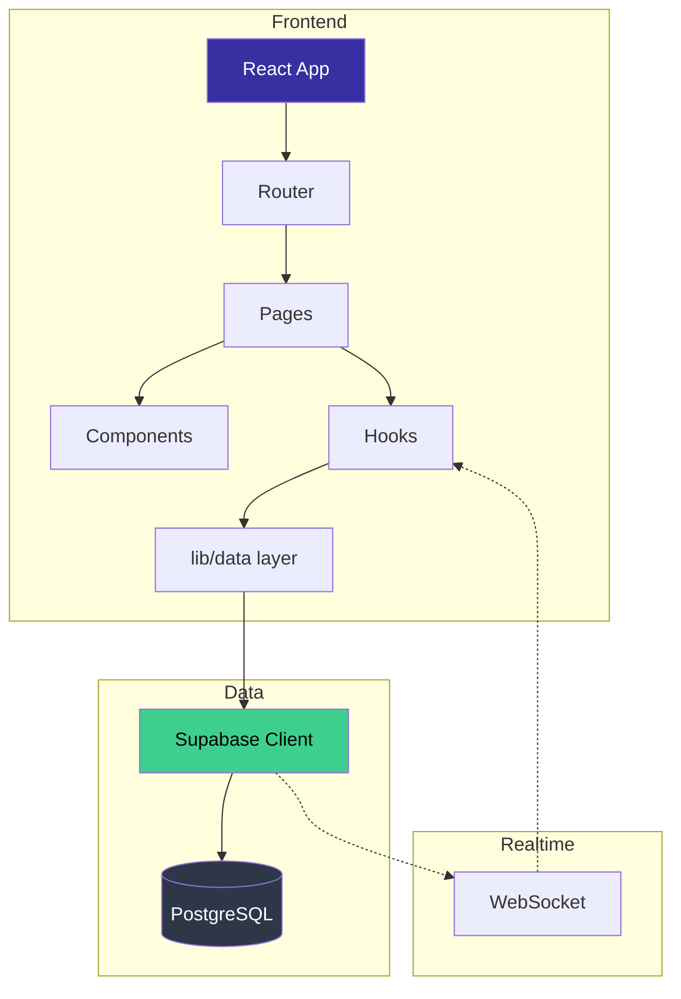
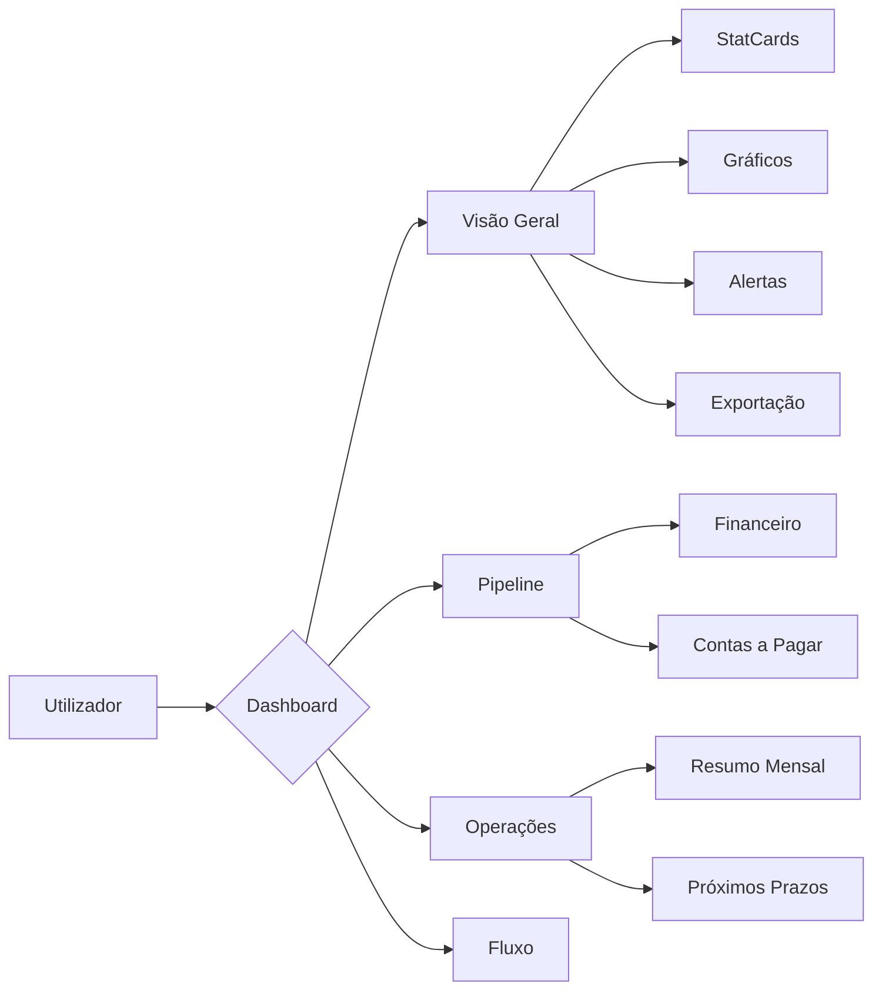
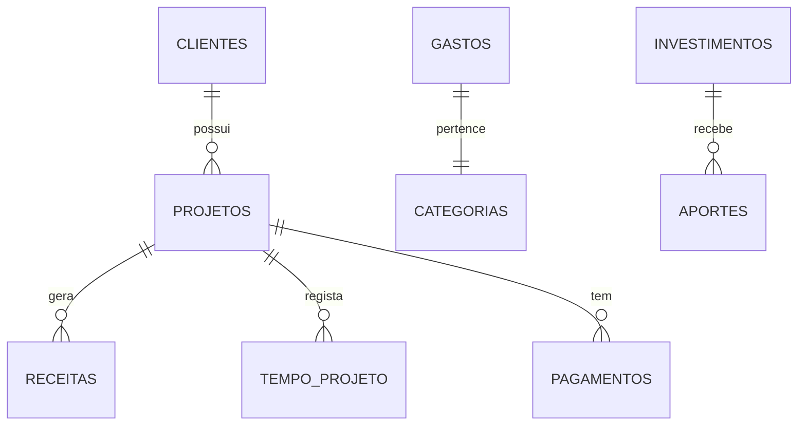

<div align="center">
  <br />
  
  <h1 align="center">DevFlow</h1>
  <p align="center">
    <strong>Freelancer Operations Cockpit</strong>
    <br />
    Gestão financeira, projetos, timer e investimentos — tudo num só lugar.
  </p>

  <p align="center">
    <a href="#-sobre-o-projeto">Sobre</a> •
    <a href="#-funcionalidades">Funcionalidades</a> •
    <a href="#-arquitetura">Arquitetura</a> •
    <a href="#%EF%B8%8F-estrutura">Estrutura</a> •
    <a href="#-tecnologias">Tecnologias</a> •
    <a href="#-como-executar">Como Executar</a> •
    <a href="#-variáveis-de-ambiente">Variáveis</a>
  </p>

  <br />

  <p align="center">
    
    
    
    
    
    
  </p>

  <p align="center">
    
    
    
  </p>
</div>

<br />

---

## Sobre o Projeto

**DevFlow** é um cockpit de gestão para freelancers e pequenos negócios. Ele centraliza:

- **Dashboard executivo** com visão geral de receitas, gastos, saldo e projeções
- **Gestão de projetos** com pipeline financeiro, status e prazos
- **Controlo financeiro** com receitas, gastos, categorias e exportação Excel/CSV/PDF
- **Timer de trabalho** com faturação por projeto e taxas horárias
- **Gestão de investimentos** com aportes, resgates e metas patrimoniais
- **Alertas inteligentes** para prazos próximos e contas a pagar

### Público-alvo

Profissionais autónomos, freelancers e pequenas equipas que precisam de um sistema simples mas completo para gerir as operações do dia-a-dia.

---

## Funcionalidades

### Dashboard
| Funcionalidade | Descrição |
|---|---|
| Visão geral | Receitas, gastos, saldo, ticket médio do mês |
| Performance 6M | Gráfico de área comparando receitas vs gastos |
| Radar pipeline | Donut chart com distribuição de status dos projetos |
| Desk Excel | Margem operacional, taxa de cobrança, cobertura de caixa |
| Alertas | Prazos próximos, contas a vencer, projetos em atraso |
| Exportação | CSV, Excel formatado e PDF do relatório completo |

### Projetos
- CRUD completo com criação automática de clientes
- Pipeline financeiro com valor total, pago e em aberto
- Filtros por status e pesquisa textual
- Atualização rápida de status
- Links para repositório e staging

### Finanças
- Registo de receitas e gastos com categorias
- Filtro por período, categoria e estado de pagamento
- Gráficos de análise mensal
- Exportação por período

### Timer
- Controlo start/stop com seleção de projeto
- Cálculo automático de duração
- Faturação estimada com taxas por projeto
- Histórico de sessões

### Investimentos
- Registo de ativos com metas de valor e data
- Aportes, resgates e rendimentos
- Progresso visual por investimento
- Alocação por tipo de ativo

---

## Arquitetura



### Fluxo da Aplicação



### Modelo de Dados



---

## Estrutura do Projeto

```
devflow/
├── web/                          # Frontend (React + Vite)
│   ├── public/                   # Assets estáticos
│   └── src/
│       ├── @types/               # Declarações TypeScript
│       ├── components/           # Componentes reutilizáveis
│       │   ├── ui/               # UI primitives (Panel, Skeleton, Badge)
│       │   ├── charts/           # Gráficos (Area, Bar, Donut, Pie)
│       │   ├── layout/           # Layout (AppLayout, Sidebar, Header)
│       │   └── shared/           # Shared (EmptyState, ErrorBoundary)
│       ├── hooks/                # Custom hooks
│       ├── lib/                  # Utilitários, configurações, tipos
│       │   ├── supabase/         # Supabase client + data layer
│       │   └── format/           # Formatadores financeiros
│       ├── pages/                # Páginas da aplicação
│       ├── test/                 # Testes unitários
│       └── main.tsx              # Entry point
├── database/                     # Modelos Python + SQL policies
├── supabase/
│   └── migrations/               # Migrações da base de dados
├── assets/                       # Logos, imagens
├── documentacao/                 # Documentação adicional
├── .editorconfig
├── .env.example
├── .prettierrc
└── README.md
```

### Estrutura Detalhada (Frontend)

```
web/src/
├── @types/
│   └── lucide-react.d.ts         # Tipos para os ícones
│
├── components/
│   ├── ui/                       # Componentes base
│   │   ├── panel.tsx
│   │   ├── skeleton.tsx
│   │   ├── stat-card.tsx
│   │   ├── status-badge.tsx
│   │   ├── pagination.tsx
│   │   ├── notice-banner.tsx
│   │   └── alert-banner.tsx
│   ├── charts/                   # Visualização de dados
│   │   ├── data-viz.tsx          # Area, Bar, Donut, Pie charts
│   │   └── rate-card.tsx
│   ├── layout/                   # Layout e navegação
│   │   ├── app-layout.tsx
│   │   └── page-section-nav.tsx
│   └── shared/                   # Componentes partilhados
│       ├── error-boundary.tsx
│       ├── empty-state.tsx
│       ├── full-screen-loader.tsx
│       ├── export-dropdown.tsx
│       └── month-year-picker.tsx
│
├── hooks/
│   ├── use-async-data.ts         # Data fetching com AbortController
│   └── use-realtime-sync.ts      # Subscrição realtime + polling
│
├── lib/
│   ├── supabase/
│   │   ├── client.ts             # Cliente Supabase
│   │   └── data.ts               # Operações CRUD
│   ├── format/
│   │   ├── currency.ts           # formatCurrency, formatRatio, etc.
│   │   ├── date.ts               # parseDateValue, formatDate, getMonthBounds
│   │   └── project.ts            # isOpenProject, projectDueAmount, etc.
│   ├── export/
│   │   ├── csv.ts                # Exportação CSV
│   │   ├── excel.ts              # Exportação Excel (.xlsx)
│   │   └── pdf.ts                # Exportação PDF
│   ├── types.ts                  # Interfaces e tipos
│   ├── schemas.ts                # Validação Zod
│   ├── cn.ts                     # classnames utility
│   └── navigation.ts             # Helpers de rota
│
├── pages/
│   ├── dashboard-page.tsx        # Dashboard principal
│   ├── finance-page.tsx          # Gestão financeira
│   ├── projects-page.tsx         # Gestão de projetos
│   ├── investments-page.tsx      # Gestão de investimentos
│   ├── timer-page.tsx            # Timer de trabalho
│   └── config-page.tsx           # Configurações
│
├── test/
│   ├── setup.ts                  # Setup do Vitest
│   └── format.test.ts            # Testes de formatação
│
├── App.tsx                       # Router principal
├── main.tsx                      # Entry point
└── index.css                     # Estilos globais + design tokens
```

---

## Tecnologias

### Frontend

| Tecnologia | Versão | Propósito |
|---|---|---|
| [React](https://react.dev/) | 19.x | UI Library |
| [TypeScript](https://www.typescriptlang.org/) | 5.7 | Type Safety |
| [Vite](https://vitejs.dev/) | 8.x | Build Tool |
| [Tailwind CSS](https://tailwindcss.com/) | 3.4 | Estilos utilitários |
| [React Router](https://reactrouter.com/) | 7.x | Roteamento SPA |
| [Recharts](https://recharts.org/) | 2.x | Gráficos responsivos |
| [Lucide React](https://lucide.dev/) | 0.577 | Ícones |
| [Supabase JS](https://supabase.com/docs/reference/javascript) | 2.x | Cliente de BD + Realtime |
| [Zod](https://zod.dev/) | - | Validação de schemas |
| [ExcelJS](https://github.com/exceljs/exceljs) | 4.x | Geração de Excel |
| [jsPDF](https://github.com/parallax/jsPDF) | 2.x | Geração de PDF |

### Qualidade

| Ferramenta | Propósito |
|---|---|
| [Vitest](https://vitest.dev/) | Testes unitários |
| [ESLint](https://eslint.org/) + TypeScript ESLint | Linting |
| [Prettier](https://prettier.io/) | Formatação de código |
| [EditorConfig](https://editorconfig.org/) | Consistência entre editores |

---

## Como Executar

### Pré-requisitos

- Node.js >= 20.x
- npm >= 10.x
- Uma conta [Supabase](https://supabase.com) (gratuita)

### Setup

```bash
# 1. Clonar o repositório
git clone https://github.com/your-username/devflow.git
cd devflow

# 2. Configurar variáveis de ambiente
cp .env.example .env
# Editar .env com as credenciais do teu projeto Supabase

# 3. Instalar dependências
cd web
npm install

# 4. (Opcional) Aplicar políticas de segurança no Supabase
# Abrir database/supabase_policies.sql no SQL Editor do Supabase

# 5. Iniciar em desenvolvimento
npm run dev
```

A aplicação estará disponível em `http://localhost:5173`.

### Scripts

| Comando | Descrição |
|---|---|
| `npm run dev` | Inicia servidor de desenvolvimento |
| `npm run build` | Compila TypeScript + build de produção |
| `npm run preview` | Preview do build de produção |
| `npm run lint` | Verifica código com ESLint |
| `npm run test` | Executa testes unitários |
| `npm run test:watch` | Testes em modo watch |
| `npm run typecheck` | Verificação de tipos TypeScript |

### Deploy

A aplicação está pronta para deploy na **Vercel**:

1. Conecta o repositório à Vercel
2. Define **Root Directory** como `web`
3. Adiciona as variáveis de ambiente no painel da Vercel
4. **Build Command**: `npm run build`
5. **Output Directory**: `dist`

O ficheiro `vercel.json` já inclui:
- Rewrites para SPA (toda as rotas → `index.html`)
- Headers de segurança (CSP, HSTS, X-Frame-Options)

---

## Variáveis de Ambiente

| Variável | Obrigatória | Descrição |
|---|---|---|
| `VITE_SUPABASE_URL` | Sim | URL do projeto Supabase |
| `VITE_SUPABASE_ANON_KEY` | Sim | Chave anónima/pública do Supabase |
| `SUPABASE_URL` | Não | URL para scripts Python (backup) |
| `SUPABASE_KEY` | Não | Service role key para scripts Python |

> **Apenas a chave anónima (`anon key`) deve ser usada no frontend.**  
> A service role key só é necessária para scripts de backend/CLI.

### Configuração do Supabase

Para o projeto funcionar, as seguintes tabelas precisam de existir no Supabase:
- `clientes`, `projetos`, `gastos`, `receitas`
- `investimentos`, `aportes`, `tempo_projeto`
- `configuracoes`, `pagamentos`

Execute o script `database/supabase_policies.sql` no SQL Editor para configurar as políticas de segurança necessárias.

---

## Decisões de Arquitetura

### Porquê Supabase e não um backend próprio?

O Supabase fornece PostgreSQL, autenticação, realtime e storage num único serviço, eliminando a necessidade de manter um backend separado. Para um projecto individual/pequeno negócio, é a escolha certa.

### Porquê React Router v7 com layout aninhado?

O `AppLayout` funciona como layout principal, com `<Outlet />` para renderizar as páginas filhas. Isto permite:
- Sidebar e header consistentes em todas as páginas
- Estado do menu mobile partilhado
- Tema aplicado globalmente

### Porquê polling + Realtime?

O `useRealtimeSync` combina subscrições WebSocket do Supabase com um fallback de polling para garantir que os dados estão sempre actualizados, mesmo quando a ligação realtime falha.

### Porquê CSS Variables e não Tailwind puro?

As variáveis CSS (`--brand`, `--surface-1`, etc.) permitem theming dinâmico (dark/light) com transições suaves, mantendo a consistência visual.

---

## Roadmap

- [ ] Testes de integração com Cypress/Playwright
- [ ] Modo offline com IndexedDB
- [ ] Notificações push para alertas de prazos
- [ ] API REST (Python FastAPI) para processamento batch
- [ ] Multilinguagem (i18n)
- [ ] Dashboard customizável (drag & drop)
- [ ] Integração com Stripe para facturação automática
- [ ] App mobile (React Native)

---

## Licença

Distribuído sob a licença MIT. Consulta o ficheiro `LICENSE` para mais informações.

---

<div align="center">
  <p>Feito com dedicação por <a href="https://github.com/sillah">Mohamed Sillah</a></p>
</div>
