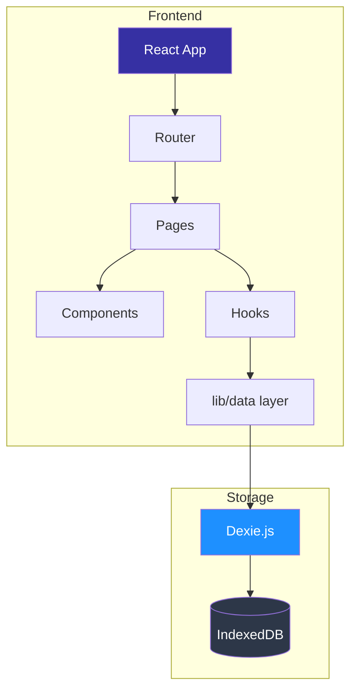
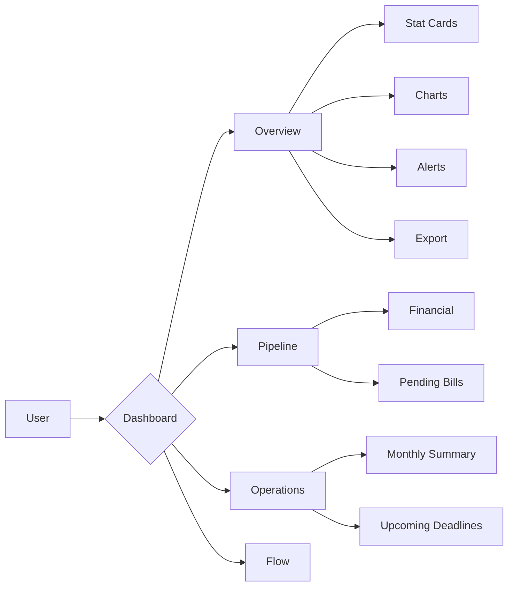
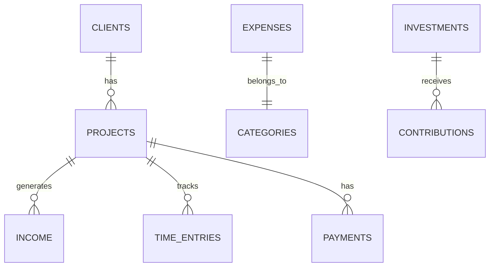

<div align="center">
  <br />
  <h1 align="center">DevFlow</h1>
  <p align="center">
    <strong>Open-source operations cockpit for freelancers and small teams</strong>
    <br />
    Dashboard, projects, finances, time tracking, and investments — all in one place.
  </p>

  <p align="center">
    <a href="#features">Features</a> •
    <a href="#architecture">Architecture</a> •
    <a href="#quick-start">Quick Start</a> •
    <a href="#documentation">Docs</a> •
    <a href="#contributing">Contributing</a>
  </p>

  <br />

  <p align="center">
    
    
    
    
    
    
  </p>

  <p align="center">
    
    
  </p>
</div>

<br />

---

## About

**DevFlow** is a web-based operations cockpit for freelancers and small businesses. It centralizes day-to-day management into a single interface:

- **Executive dashboard** with revenue, expenses, balance, and projections
- **Project management** with financial pipeline, status, and deadlines
- **Financial control** with income, expenses, categories, and CSV/Excel/PDF export
- **Work timer** with per-project billing and hourly rates
- **Investment tracking** with contributions, withdrawals, and goal progress
- **Smart alerts** for approaching deadlines and pending bills

### Target Audience

Solo professionals, freelancers, and small teams who need a simple but complete system to run their operations.

---

## Features

### Dashboard
| Feature | Description |
|---|---|
| Overview | Revenue, expenses, balance, average ticket for the month |
| 6-month performance | Area chart comparing revenue vs expenses |
| Pipeline radar | Donut chart showing project status distribution |
| Excel-ready desk | Operating margin, collection rate, cash coverage |
| Alerts | Approaching deadlines, bills due, overdue projects |
| Export | CSV, formatted Excel, and PDF full report |

### Projects
- Full CRUD with automatic client creation
- Financial pipeline with total, paid, and outstanding amounts
- Status filters and text search
- Quick status updates
- Repository and staging URL links

### Finances
- Income and expense records with categories
- Filter by period, category, and payment status
- Monthly analysis charts
- Period-based export

### Timer
- Start/stop control with project selection
- Automatic duration calculation
- Estimated billing with per-project rates
- Session history

### Investments
- Asset registration with value and date goals
- Contributions, withdrawals, and returns
- Visual progress tracking per investment
- Allocation by asset type

---

## Architecture



### Application Flow



### Data Model



---

## Quick Start

### Prerequisites

- Node.js >= 20.x
- npm >= 10.x

### Setup

```bash
# 1. Clone the repository
git clone https://github.com/your-org/devflow.git
cd devflow

# 2. Install dependencies
cd web
npm install

# 3. Start development server
npm run dev
```

The application will be available at `http://localhost:5173`.

### Available Scripts

| Command | Description |
|---|---|
| `npm run dev` | Start development server |
| `npm run build` | TypeScript check + production build |
| `npm run preview` | Preview production build |
| `npm run lint` | Run ESLint checks |
| `npm run typecheck` | Run TypeScript type checking |
| `npm run test` | Run unit tests |
| `npm run test:watch` | Run tests in watch mode |

### Deployment

The app is ready for deployment on **Vercel** (no environment variables needed):

1. Connect the repository to Vercel
2. Set **Root Directory** to `web`
3. **Build Command**: `npm run build`
4. **Output Directory**: `dist`

The `vercel.json` file includes:
- SPA rewrites (all routes → `index.html`)
- Security headers (CSP, HSTS, X-Frame-Options)

---

No environment variables are required. All data is stored locally in your browser's IndexedDB via Dexie.js.

---

## Documentation

Full documentation is available in the [`docs/`](docs/) folder:

- [Architecture](docs/architecture.md) — Component design, data flow, routing
- [Database](docs/database.md) — Schema, relationships, RLS policies
- [Deployment](docs/deployment.md) — Vercel, Supabase setup, CI/CD
- [FAQ](docs/faq.md) — Common questions and troubleshooting
- [API Reference](docs/api.md) — Data access layer and Dexie queries
- [Decision Log](docs/decisions.md) — Architecture decisions and rationale

---

## Technology Stack

### Frontend

| Technology | Version | Purpose |
|---|---|---|
| [React](https://react.dev/) | 19.x | UI Library |
| [TypeScript](https://www.typescriptlang.org/) | 5.7 | Type Safety |
| [Vite](https://vitejs.dev/) | 8.x | Build Tool |
| [Tailwind CSS](https://tailwindcss.com/) | 3.4 | Utility-first styling |
| [React Router](https://reactrouter.com/) | 7.x | SPA Routing |
| [Recharts](https://recharts.org/) | 2.x | Responsive charts |
| [Lucide React](https://lucide.dev/) | 0.577 | Icons |
| [Dexie.js](https://dexie.org/) | 6.x | IndexedDB wrapper — local-first storage |
| [Zod](https://zod.dev/) | - | Schema validation |
| [ExcelJS](https://github.com/exceljs/exceljs) | 4.x | Excel generation |
| [jsPDF](https://github.com/parallax/jsPDF) | 2.x | PDF generation |

### Quality

| Tool | Purpose |
|---|---|
| [Vitest](https://vitest.dev/) | Unit testing |
| [ESLint](https://eslint.org/) + TypeScript ESLint | Code linting |
| [Prettier](https://prettier.io/) | Code formatting |
| [EditorConfig](https://editorconfig.org/) | Editor consistency |

---

## Architecture Decisions

### Why Dexie.js (IndexedDB) instead of a backend?

Dexie.js provides a clean async API over IndexedDB with zero configuration, no server, no environment variables, and full offline support. The adapter pattern in `lib/data/` allows adding a remote backend (e.g., Supabase, REST API) later without touching page code.

### Why React Router v7 with nested layouts?

The `AppLayout` component serves as the main layout with `<Outlet />` for rendering child pages. This enables:
- Consistent sidebar and header across all pages
- Shared mobile menu state
- Global theme application

### Why local-first instead of cloud?

Local-first with IndexedDB means zero latency, full offline support, no SSR/server costs, and instant UI updates after mutations. Data is always available regardless of network status.

### Why CSS Variables instead of pure Tailwind?

CSS custom properties (`--brand`, `--surface-1`, etc.) enable dynamic theming (dark/light mode) with smooth transitions while maintaining visual consistency.

---

## Roadmap

- [ ] Integration tests with Playwright
- [ ] Cloud sync (cross-device data synchronization)
- [ ] Push notifications for deadline alerts
- [ ] REST API (Python FastAPI) for batch processing
- [ ] i18n multi-language support
- [ ] Customizable dashboard (drag & drop)
- [ ] Stripe integration for automated invoicing
- [ ] Mobile app (React Native)

---

## Contributing

Contributions are welcome! Please see [CONTRIBUTING.md](CONTRIBUTING.md) for guidelines.

This project follows [conventional commits](https://www.conventionalcommits.org/) and enforces TypeScript strict mode.

---

## License

Distributed under the MIT License. See [LICENSE](LICENSE) for more information.

---

<div align="center">
  <sub>Built with openness for the freelancer community</sub>
</div>
